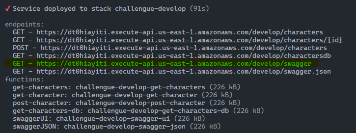
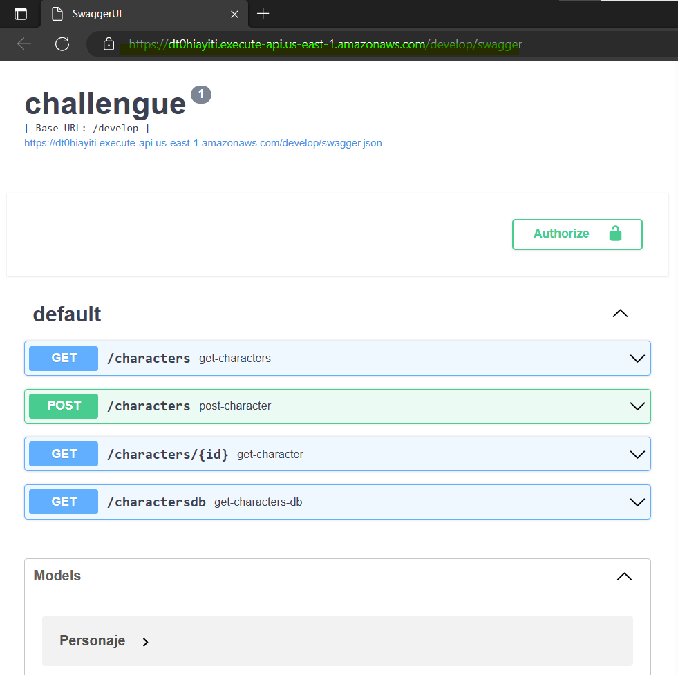

# Challengue
## Four APIs were genereted:

**GET** `/characters`: Get characters from SWAPI api, accepts queryStrings: search and page.

**GET** `/characters/:id`: Get a single character from SWAPI api.

**GET** `/charactersdb`: Retrieve list of characters from DynamoDB.

**POST** `/characters`: Create a character in DynamoDB.


## Plugins
```yaml
plugins:
  - serverless-auto-swagger
  - serverless-offline
  - serverless-esbuild 
  - serverless-stage-manager 
  - serverless-deployment-bucket
```

## Install
To install all dependencies, run the following command:
```sh
npm install 
```
## Offline
To test your service without deploying, you can use the command:
```sh
npm run dev 
```
**_NOTE_**: DynamoDB Local is not yet implemented, so you can only try all lambda functions that do not require Dynamo.
## Deploy
To deploy your service, you can use the following command:
```sh
npm run deploy 
# or
serverless deploy
# or
serverless deploy --stage develop --aws-profile profile1
```
**_NOTE_**: Do not forget to configure your AWS credentials before deploying.

**_NOTE_**: The tests will run automatically during deployment.


**_NOTE_**: Once the deployment is completed, in addition to the endpoints of the lambda functions, you will also obtain the endpoint of the Swagger UI.
## Swagger UI

**_NOTE_**: It's possible that the UI may take a little longer to become available after being deployed. Please take this into consideration if you encounter a `Missing Authentication Token` message.
## Remove 
If you want to remove your service, run the following command:
```sh
npm run remove 
```